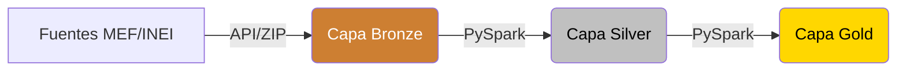

# Arquitectura del Sistema

El **MEF Data Lake** está diseñado siguiendo la **Arquitectura Medallion** clásica, utilizando Apache Spark como motor de procesamiento y Parquet como formato de almacenamiento subyacente. 

## Componentes Principales

1. **Gestor de Ingesta (Bronze)**
   - Módulo en Python puro (`src/bronze/`) que maneja las conexiones a las APIs del gobierno (CKAN) y descarga de archivos ZIP pesados de años anteriores.
   - Tiene soporte para concurrencia, reintentos y tolerancia a fallos.

2. **Motor de Procesamiento (Spark)**
   - Se utiliza **PySpark** para las etapas Silver y Gold.
   - Dada la gran volumetría de los datos (millones de registros anuales del SIAF), Spark permite realizar los cruces espaciales (UBIGEO) y las agregaciones de forma eficiente y distribuida usando DataFrames.

3. **Almacenamiento (Local Parquet)**
   - No se requieren bases de datos SQL ni data warehouses tradicionales. Todo el almacenamiento se realiza en el sistema de archivos local organizando los datos de forma columnar a través del formato **Apache Parquet**.
   - Los datos se encuentran particionados estratégicamente por año (`ANO_DOC`) para acelerar la lectura y reducir el uso de memoria RAM durante consultas exploratorias.

4. **Desarrollo y Orquestación (Jupyter Notebooks)**
   - Todo el flujo desde Silver a Gold, así como el análisis de datos, se orquesta visual y modularmente mediante cuadernos de Jupyter.
   - Permiten observar resultados intermedios de forma rápida y auditable.

## Diseño Medallion

- **Bronze**: Los datos se almacenan "tal cual" (as-is) provienen de la fuente. Suelen ser archivos NDJSON.
- **Silver**: Datos limpios, deduplicados, estandarizados, y enriquecidos. Se corrigen falsos nulos y se aplican reglas de calidad (Data Quality Flags).
- **Gold**: Datos modelados y listos para negocio. Modelos relacionales Star Schema o tablas desnormalizadas listas para tableros de BI (Business Intelligence).
